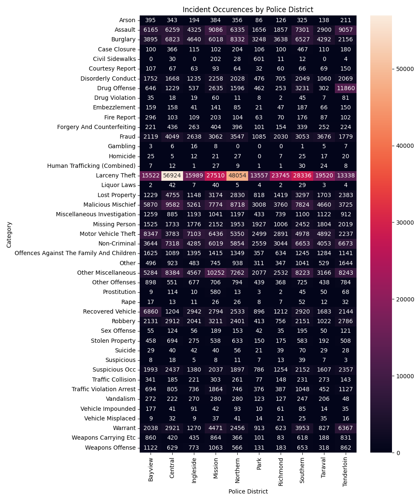
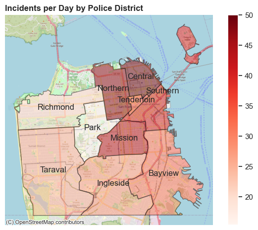
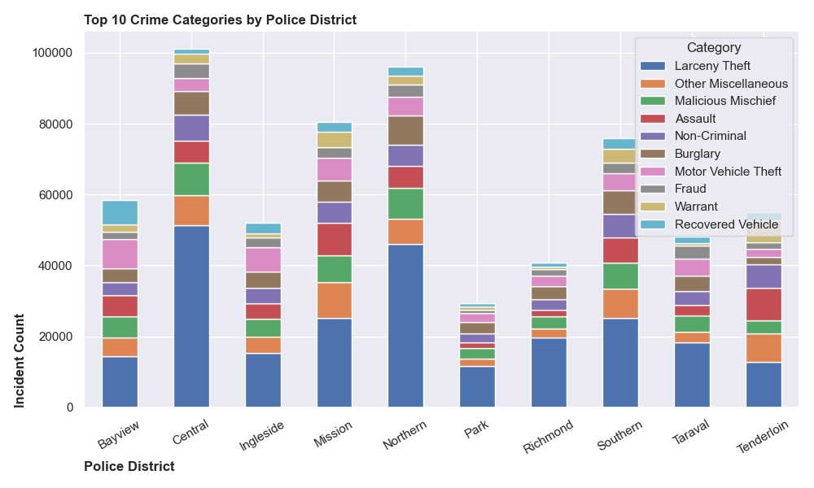
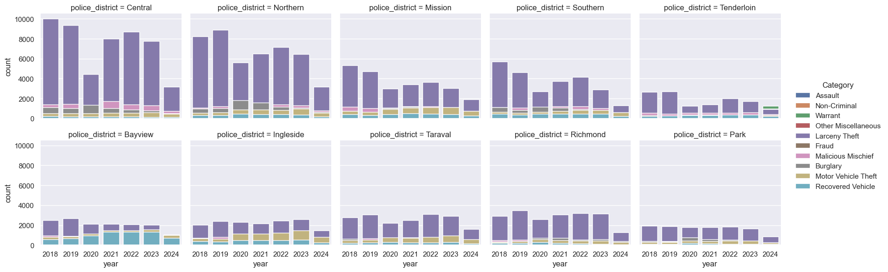

# Are we in a Doom Loop, San Francisco?
<table style="width:100%"><tr><center><td width="100%">
  
  <br><em>Figure 1: Crime Incident Distribution by location (2018 - Present)</em>
</td></center></tr></table>

<p align='right'>
Capstone Project<br>
UC Berkeley ML/AI Professional Certification coursework<br>
Fazeel Mufti
</p>
  
**Repository Structure**

* [`ExploratoryDataAnalysis.ipynb`](https://github.com/fazeelgm/UCB_ML_AI_Capstone/blob/main/notebooks/ExploratoryDataAnalysis.ipynb)
  * Jupyter notebook containing the initial exploratory data analysis (EDA) of the dataset to develop a domain understanding
  * Summarized in the [The Data](https://github.com/fazeelgm/UCB_ML_AI_Capstone/blob/main/README.md#the-data---sfpd-daily-crime-incidents-reports) section below
* [`ModelExploration.ipynb`](https://github.com/fazeelgm/UCB_ML_AI_Capstone/blob/main/notebooks/ModelExploration.ipynb)
  * Jupyter notebook detailing the Data Models that were explored
  * Summarized in the [Model Development](https://github.com/fazeelgm/UCB_ML_AI_Capstone/blob/main/README.md#model-development) section below
* [`ModelVisualizations.ipynb`](https://github.com/fazeelgm/UCB_ML_AI_Capstone/blob/main/notebooks/ModelVisualizations.ipynb)
  * Visualizations developed to support the Doom Loop story narative
  * Summarized in the [Doom Loop? Ground Reality](https://github.com/fazeelgm/UCB_ML_AI_Capstone/blob/main/README.md#doom-loop-ground-reality) section below
* `src` directory: Utility python code for the project
* `data` directory: Sampled data (10%) or can get the latest from SFGov links below
* `models` directory: Serialized models for production deployment

## Executive summary

I am interested in forecasting and classification problems and use of data for finding solutions to social issues. As a San Francisco resident, I was skeptical of the constant reporting about the **_San Francisco Doom Loop_** - that the city's downtown area is in a downward spiral due to a combination of pandemic-related effects, declining foot traffic, rising homelessness, drug use, and businesses closing. The term gained traction as offices remained empty following COVID-19, which reduced the city's tax revenues, led to closures of key stores, and increased concerns about safety.

I came across this daily feed from the SF Police Dept. (SFPD) from January 2018 thru the present and wanted to use this data of triaged crime incidents as a way to test the **_San Francisco Doom Loop hypothesis_**. My goals are to:

> 1. Correctly classify the crime category based on the historical data as categorized by SFPD officers
> 1. Learn how Machine Learning (ML) and Data Sciences (DS) can be applied to Social Engineering issues

This work is part of my Capstone Project for the UC Berkeley Artificial Inetlligence and Machine Learning Professional Certification.

### TL;DR

The dataset contains almost a million crime incident reports since 2018 that are recorded when police officers arrive at the scene of the crime and traige the situation. Each row contains location and time information along with a crime classification assigned to the case - this makes it a good barometer of crime as it happens, but we cannot deduce the quality of crime resolution from this data as that happens after the fact. Figure 1 shows each crime incident super-imposed on top of San Francisco map - _doom loop_ indeed!

Our task was to use this data to train different ML models on this data and then train them on a subset of the incidents and then judge them on their prediction abilities on the remainder of the incidents that the model had not seen. In the process, we wanted to get to the bottom of the Doom Loop charge - here's what we learnt!

>This is a hard problem!

After cleaning the data, we identified and trained a set of ML Models that are suitable for multi-class classification problems of this type. After many optimization and tuning iterations, the winning `XGBClassifier` model achieved an Accuracy score of 35% (higher is better) with a LogLoss score of 2.3240 (lower is better, 0 being a perfect score) and were able improve our results by 206% (Accuracy) and 92.72% (LogLoss) over our baseline benchmark. A single tuning run of the final model took over 4 hours to train on our hardware!

For a large dataset with noisy labels, we were able to achieve an accuracy of 35.01% for a 45-class classification problem using only 14 input features. Seeing the fact that the accuracy benchmark for uniform blind guess is 2.22% (1 out of 45 possible classes), this is a reasonably good result - but we have to admit that this is a hard problem to solve without enriching our dataset.

In addition to the crime classification capabilities of the model, the model also provides explanations on how it makes its decisions. This information can be really useful for improving the Polices' ability to identify locations and times for specific crime patterns, as well as learn from historical data to target crime hoptspots. Here are two example of actual Auto Theft incidents from our dataset, one in the morning and one at night that the model identified correctly, alongwith the weighting of the input features that were used for its predictions. In the first case, we see how the model gives an 89% probability of an auto theft, using time and location components in making it's prediction - around noon-time, the temporal component is weighed heavily in the classification (red bars bumping the confidence higher). 

<table style="width:100%"><em>Figure 2: SHAP Auto Theft Incidents at noon- vs night-time</em>
<tr>
  <td width="100%"></td>
</tr></table>

For the second incidence late at night, we see a lower probability (9%) of the car being stolen, but the model weighs the neighborhood location as a greater component in it's decision making, reducing it's overall confidence level (blue bars).

<table style="width:100%"><em>Figure 3: SHAP Auto Theft Incidents at noon- vs night-time</em>
<tr>
  <td width="100%"></td>
</tr></table>

This shows us that the model is learning effectively and intuitively!

>The more things change, the more they remain the same!

We next looked at the daily rates of crime incidents to see if there were more crimes occuring around Covid - if anything, we found that the rate has actually slowed down! Looking at the trend line across all incidents in the left graph, it's difficult to tell if that is really the case, but when we break it down by quarter to adjust for partial 2024 returns, we see that overall crime rates have come down in 2024 to the 2020 Covid levels and are lower than the pre-Covid period of 2018-2019. This is good news! 

<table style="width:100%"><tr><em>Figure 4: Feature importance, confusion matrix and decision tree (Click on image to see details)</em>
  <td width="50%"></td>
  <td width="50%"></td>
</tr></table>

>It's the stories we tell!

Digging deeper, we looked at crime across different categories, locations and police disctricts and realized that it's possible to slice and dice the information to suit many narratives. You can go thru the [detailed analysis below](https://github.com/fazeelgm/UCB_ML_AI_Capstone/blob/main/README.md#doom-loop-ground-reality) - but the gist of what I found can be seen in this graphic showing the SFPD's crime resolution rate for the top-10 crime categories by precinct - responsiveness likely creates a positive outlook while cases backing up frustrates public pereception as well as reporting of crimes, aka Doom Loop! You can see that during Covid, case resolution lagged across all categories, but has been picking up since then. So staffing could be important but we cannot deduce that from this data. Looking specifically at the Tenderloin district, a historically troubled area, we can see the extra attention being paid this year - perhaps due to all the attention from a tough mayoral race!

<table style="width:100%"><tr>
  <td width="100%"><em>Figure 5: Incident Resolution by Police District by Year</em>
    </td>
</tr></table>

This is a very high-level synopsis of my findings, I invite you to read the rest of this Summary Report and dive deeper into the associated notebooks - there is a lot of interesting data, especially for anyone who's walked the streets of San Francisco!

# The Data - SFPD Daily Crime Incidents Reports

As part of the [City of San Francisco's Open DataSF Project](https://datasf.org/opendata/), the San Francisco Police Deparment (SFPD) provides a daily feed of Police Crime Incidents to the public for accountability purposes. This data has been made available since 2003 and provides a snapshot of crimes reported and investigated by the SFPD. Incoming reports are triaged and categorized based on the incident details and resolution. As such, this is a great resource on the makeup of crime in the City, and gives us an opportunity to apply Data Science (DS) and Machine Learning (ML) to analyze trends over a significant period of time.

The dataset is available as two CSV files with historical data from 2003-2018 and 2018-Present:

1. [San Franciso Police Department Incident Reports: Historical 2003 to May 2018](https://data.sfgov.org/Public-Safety/Police-Department-Incident-Reports-Historical-2003/tmnf-yvry/about_data)
1. [Police Department Incident Reports: 2018 to Present](https://data.sfgov.org/Public-Safety/Police-Department-Incident-Reports-2018-to-Present/wg3w-h783/about_data)

For this project, we will use the 2018-Present data as we are focused on the Doom Loop around the Covid Pandemic period:

* DataType: Time Series data for SFPD incidents reported by:
  * Police officers
  * Citizens using SFPD website and Twitter/X
* Published daily and ranges from Jan 1, 2003 up to the current time - as of Oct 2, 2024, my last snapshot, there are 894,585 records to analyze!
* The datafeed contains one incident per row, with some incidents spanning multiple rows as the police officer investigates the situation at the scene of the crime. The data does not include any subsequent investigation after the initial crime _recording_
* There are 35 feature columns containing different attributes about the incidents containing:
  * Categorization and sub-categorization of incidents, as well as resolution codes
  * GIS (latitude, longitude) and neighborhood data that can be cross-indexed with other SF City datasets
* Contains data for _incoming incidents_, not their final resolution, so this is not a way to gauge crime resolution, but onlhy a barometer of the overall incidence rates
  
## Methodology
1. Exploratory Data Analysis: we first analyze the data to understand it and prepare it for the Data Modeling phase. The work summarized here is detailed in the [`ExploratoryDataAnalysis.ipynb`](https://github.com/fazeelgm/UCB_ML_AI_Capstone/blob/main/notebooks/ExploratoryDataAnalysis.ipynb) Jupyter notebook
2. Model Exploration: We start with a few ML models suitable for multi-class classification problems, identify good candidates for optimization and evaluate them on our evaluation criteria - details in the [`ModelExploration.ipynb`](https://github.com/fazeelgm/UCB_ML_AI_Capstone/blob/main/notebooks/ModelExploration.ipynb) notebook
3. Interpretation of Best Model: Finally we apply learnings from the trained model to our Doom Loop scenario - see [`ModelVisualizations.ipynb`](https://github.com/fazeelgm/UCB_ML_AI_Capstone/blob/main/notebooks/ModelVisualizations.ipynb)

## Exploratory Data Analysis

### Feature Engineering

Since this data is used for both incident recording as well as internal data house-keeping, during the first pass, we used the following strategy to reduce the initial set of columns:

* Columns that are mostly empty and not related to our classification problem
  * `esncag_-_boundary_file`
  * `central_market/tenderloin_boundary_polygon_-_updated`
  * `civic_center_harm_reduction_project_boundary`
  * `hsoc_zones_as_of_2018-06-05`
  * `invest_in_neighborhoods_(iin)_areas`
* Any administrative columns that are not related to predicting the crime category from its related features:
  * `report_type_code`
  * `report_type_description`
  * `filed_online`
* Columns that identify street or address information that we will not be using as we are focused on predictions based on LatLong, neighborhood or Police District and Precinct
  * `intersection`
  * `cnn`
  * `Point: Redundant since we have latitude, longitude`
* Columns that have to do with City governance and not related to crime prediction
  * `supervisor_district`
  * `supervisor_district_2012`
  * `crrent_supervisor_districts`

### Temporal Features

Our data is indexed by DateTimeStamp, but this is not very useful to work with. We converted the time of each incidence to it's component values to facilitate analysis and for consideration by our ML models:

  * `hour`
  * `minute`
  * `day`
  * `month`
  * `year`
  * `Day of Week`

In addition, time has semantic meaning beyond it's absolute value and concepts like weekends, holidays need to be represented in our predictions. So we introduced new synthetic features to address this issue:

* `weekend`
* `season`: Winter, Spring, Summer, Fall
* `US Holidays`
* `Time of Day`: Morning, Afternoon, Evening, Night

### Geo-Based Features

According to [LatLong.net](https://www.latlong.net/place/san-francisco-bay-area-ca-usa-32614.html) the San Francisco County is bounded by the following rectangle:

* Latitude Range:
  * Northern limit: 37.8330° N
  * Southern limit: 37.7031° N
* Longitude Range:
  * Western limit: -122.52279° W
  * Eastern limit: -122.3515° W

We verified that all data was within these bounds - the SFPD has actually done a good job as no exceptions were discovered.

### Incident-Specific Features: Target Variable - Category

We then looked at features that are important for classifying the incidents because there were mulitple rows with the same incident ID, and we found the explanation as follows (from the [DataSF Dataset Explainer](https://sfdigitalservices.gitbook.io/dataset-explainers/sfpd-incident-report-2018-to-present#multiple-incident-codes)):

>Incident reports can have one or more associated Incident Codes. For example, an officer may have a warrant for an
>arrest and while making the arrest, discovers narcotics in the individual’s possession. The officer would record
>two Incident Codes: (1) for the warrant and (2) for the discovery of narcotics.
>
>When multiple Incident Codes exist, the Incident ID, Incident Number and CAD Numbers remain the same and the
>Row ID field can be used as a unique identifier for each row of data. An example is provided below.

Since we are interested in predicting the `incident_category` based on time and location, we'll retain  all three rows, each with a different category, but remove the columns that merge them into a single incident. This gives us more training data with a whetted outcome, i.e. target variable.

So we removed the following columns:

  * incident_datetime / report_datetime
  * incident_id / incident_code / row_id / incident_number / cad_number
  * incident_subcategory
  * incident_description

and only retained `incident_category` as our target variable:

<table style="width:100%"><tr>
  <td width="100%"><em>Figure 6: Category, our target variable, has 49 possible classes and is highly imbalanced</em></td>
</tr></table>

Looking at the `category` distribution, we noticed the following categories:

* `Human Trafficking (A), Commercial Sex Acts` (10 occurences) and `Human Trafficking, Commercial Sex Acts` (3 occurences): Since they are so few, we'll comnine them into a single `Human Trafficking (Combined)` class
* `Motor Vehicle Theft` (4,900 occurences) and `Motor Vehicle Theft?` (8 occurences) are similar enough that I converted them into the dominant class
* `Weapons Offense` (619 occurennces) `Weapons Offence` (4 occurences) look like an entry error, so they were converted to the dominant class

This left us with 45 possible Cateogries that a crime can be classified in San Francisco, and these will be the prediction outputs of our ML models.

### Police District Specific Features

We also looked at Police District and Neighborhood features and cleaned them up so we could train our on these two specific dimenions. Here is a heatmap of the Crime Categories distributed across the repobsible Police Districts based on the <latitude, longituded> of the incidence location.

<table style="width:100%"><tr>
  <td width="100%"><em>Figure 7: Police District Heatmap of all Incidents</em></td>
</tr></table>

Overall, we found numerous data entry issues that were fixed or cleaned as much as possible. The remaining data is due to human error and is difficult to "fix" easily. After this cleanup, here is the final list of features that will be used to train our models:
```
<class 'pandas.core.frame.DataFrame'>
DatetimeIndex: 829328 entries, 2023-03-11 14:00:00 to 2023-03-21 17:42:00
Data columns (total 18 columns):
 #   Column           Non-Null Count   Dtype  
---  ------           --------------   -----  
 0   date             829328 non-null  object 
 1   time             829328 non-null  object 
 2   year             829328 non-null  int64  
 3   dow              829328 non-null  object 
 4   category         829328 non-null  object 
 5   resolution       829328 non-null  object 
 6   police_district  829328 non-null  object 
 7   neighborhood     829328 non-null  object 
 8   latitude         829328 non-null  float64
 9   longitude        829328 non-null  float64
 10  hour             829328 non-null  int64  
 11  minute           829328 non-null  int64  
 12  day              829328 non-null  int64  
 13  month            829328 non-null  int64  
 14  weekend          829328 non-null  int64  
 15  season           829328 non-null  object 
 16  holiday          829328 non-null  bool   
 17  tod              829328 non-null  object 
dtypes: bool(1), float64(2), int64(6), object(9)
```

# Model Development

The task of classifying the incident types based on a set of historical attrirbutes (features) and predicting on similar attributes is a **multiclass classification** problem. We will now experiment on some ML models that are generally used for similar problems to see what would be the best choice for us.

We will evaluate the following models:

* Simple classification models
  * `DummyClassifier` to get a baseline for our project
  * `LogisticRegression` with L1 Regularization
* Multiclass classifiers
  * `KNeighborsClassifier`
* Ensemble methods: Since our dataset has high variability with a lot of numerical and cagtegorical features with a range of mean and variance, we plan to employ ensemble methods and tune them for best results
  * `RandomForestClassifier`
  * `XGBClassifier`: We considered `XGLite` but selected XGBoost as it provides better model explainability features like SHAP values, which we expect to be able to use in explaining our results

## Evaluation Metrics

In this project, we are predicting or classifying across 45 crime categories. We will use two evaluation metrics to compare our models:

1. **Accuracy**: Measures the proportion of correct predictions over all predictions made. The accuracy benchmark is 1/45 or 2.22% given our crime categories is a rough benchmark that we will keep in mind. We will try to maximize our classification accuracy

$$
\text{Accuracy} = \frac{\text{Number of correct predictions}}{\text{Total number of predictions}} = \frac{TP + TN}{TP + TN + FP + FN}
$$

3. **Log_Loss**: Measures the accuracy of a classifier by penalizing false classifications. It does this by taking the negative logarithm of the predicted probability for the true class. The goal is to minimize this loss, meaning that higher probabilities are assigned to the correct classes. Log loss is a powerful way to evaluate not just if the model is making the right predictions, but how confident it is in those predictions. A lower log loss indicates a model that is both accurate and confident and a value of 0 would mean that all predictions were correct!

$$
\[
\text{Log-Loss} = -\frac{1}{N} \sum_{i=1}^{N} \left[ y_i \log(p_i) + (1 - y_i) \log(1 - p_i) \right]
\]

Where:
- \( N \) is the number of samples
- \( y_i \) is the true label (either 0 or 1)
- \( p_i \) is the predicted probability of the positive class (class 1)
$$

While accuracy provides a simple measure of correctness, log-loss offers a more nuanced view by considering how confident those predictions are. A model that predicts with 51% confidence for the correct class will have the same accuracy as one that predicts with 99% confidence, but their log loss will be very different. The 99%-confident model will have a much lower log loss.

We'll use them together for a comprehensive evaluation and to learn more about them.

## Data Preparation

1. Encode numeric and categorical features so they can be ingested by the models
2. Create two datasets, training and validation, by splitting 80/20%, stratigying it on the target column
3. Scaled the data using `StandardScaler`

## Model Exploration

### Baseline Modeling

Used the Scikit-Learn `DummyClassifier` method to get a baseline for our predictions - testing the different strategies that it supports. We will use the `stratified` strategy to match our evaluation Log-Loss metric that is based on probabilistic distribution of the target variable and because we have a highly imbalanced distribution

<table style="width:100%"><tr>
  <td width="100%"><em>Figure 8: Baseline Model Testing</em></td>
</tr></table>

### Candidate Models

Narrowed down the top 3 candidates for further investigation based on their Accuracy and LogLoss scores before proceed to brute-force hyperparameter tuning:

<table style="width:100%"><tr>
  <td width="100%"><em>Figure 9: Candidate Models for Tuning</em></td>
</tr></table>

### Hyperparameter Tuning

We are now ready to tune models with a more comprehensive optimization of their training parameters. We looked at brute-force `GridSearchCV` and Randomized Parameter Optimization, but based on literature search, decided to use `BayesSearchCV` because it uses the results from previous optimization attempts to inform subsequent attempts. It builds a probability model of the objective function, mapping the input values to the probability of a loss. This surrogate model is easier to optimize than the actual objective function and allows `BayesSearchCV` to select the next hyperparameter combination. More time is spent in selecting the next optimization parameters than brutely trying them all out.

Our model selection run will:

* Use stratified 3-Fold cross validation
* Only use 5 iterations due to the limitation of our hardware given the large dataset

During the initial optimization runs, we tuned the parameters if the model didn't converge or took too long.

<table style="width:100%"><tr>
  <td width="100%"><em>Figure 10: Hyperparameter Tuning Results</em></td>
</tr></table>

## Model Evaluation & Interpretation

<table style="width:100%"><tr>
  <td width="100%"><em>Figure 11: Results Tally</em></td>
</tr></table>

Evaluating the final tuned model scores, we see that:

* We see that `XGBClassifier` consistently did better in both our evaluation metrics
* However, `RandomForestClassifier` improved the most from it's own baseline score
* The final tuned model scored 2.3240 log-loss, improving 92.72% from the `DummyClassifier` baseline score and 35.01% Accuracy on the Test dataset
* Given the exceptionally long training time required for `XGBClassifier` (over 4 hours) relative to `RandomForestClassifier` (about 17 minutes), the difference in log-loss is negligible and it may be an acceptabel model for our classification problem
* We expected the overall scores to be low due to the quality of the data and the imbalanced target distribution, so the results are considered acceptable

We also used other tools below to evaluate our best model:

* Classification Report
* Confusion Matrix
* Feature Importance
* Decision Tree

We can make the following observations:

1. The accuracy report shows that for our top category, `Larceny Theft`, the F-1 score is highest at 56% suggesting that our model does well when there is ample data and is working intuitively
2. Looking at the feature importance graph, we see all the syntheitc features, like holidays and time of day `tod`, that we added during the feature engineering phase are being used in the prediction process!
3. The XGB decision tree shows the shallow depth reflects our feature importance distribution and shows that the model is well-trained
4. The Confusion shows the reason for our low accuracy scores is due to the imbalanced classes and that there may not be sufficient data for them

Even though our overall classification rate may be low, our tuned model improved by 92.72% over the baseline benchmark. For a large dataset with noisy labels, we were able to achieve an accuracy of 35.01% for a 45-class classification problem using only 14 input features. Seeing the fact that the accuracy benchmark for uniform blind guess is 2.22% (1 out of 45 possible classes), this is a reasonably good result - but we have to say that this is a hard problem to solve without enriching our dataset.

<table style="width:100%"><tr><em>Figure 12: Feature importance, confusion matrix and decision tree (Click on image to see details)</em>
  <td width="33%"></td>
  <td width="33%"></td>
  <td width="33%"></td>
</tr></table>

## Model Explanation

To look at our model from an exlainability angle, we used the SHAP (SHapley Additive exPlanations) Python package. SHAP can be used to explain the prediction of a single sample by computing the contribution of each feature to the prediction. Let us do this now on our validation set.

Let's consider 2 samples of auto theft (category 22) in our dataset:

<table style="width:100%"><em>Figure 13: SHAP Auto Theft Incidents at noon- vs night-time</em>
<tr>
  <td width="100%"></td>
</tr><tr>
  <td width="100%"></td>
</tr></table>

In the SHAP explanation `force_plot` the `base value` shows the approximate location of the average predicted values across the training set. The bolded value is the model probability for this sample being assigned the class `Motor Vehicle Theft` due to the feature values - hence similar samples will also be classified similarly. The red bars represent the features that have conributed positively to the prediction's deviation from the base value, and the length of the bar indicates the features contribution. The blue bar represents negative contribution. 

In the first case, we can see how our model gives an 89% probability of an auto theft, using time and location components in making it's prediction and around noon-time, the time component is weighed heavily in the classification.

For the second incidence late night, we see a lower probability (9%) of the car being stolen, but the model adds the neighborhood location as a greater component in it's decision making

This shows us that the model is learning effectively and intuitively!

We can also look at all the auto theft samples together to see how this class is being labeled by the model and use this for addressing auto thefts for specific scenarios.

<table style="width:100%"><tr>
  <td width="100%"><em>Figure 14: Results Tally</em></td>
</tr></table>


## Deployment & Implementation

We prepared the tuned models for production deployment as follows:

1. Use `joblib.dump()` function to serialize the fitted models to disk
1. These can then be deloyed to the production environment
1. Use `joblib.load()` function to read the saved model into our notebook
1. Tested by invoking the `predict()` method on a few test samples

This allows us to preserve the hard-to-train models and make the deployment process scalable for production environments.

# Doom Loop? Ground Reality

We start exploring the Doom Loop story line by building our own narrative that is based on the facts coming from our dataset. First, we look at the crime distribution across the San Francisco by Police Districts. Here you see a map view and a breakdown of the top-10 crime categories across each police district. This gives us an idea of where to focus for the largest swath of crimes:

<table style="width:100%"><em>Figure 15: Police Districts at-a-glance</em>
<tr>
  <td width="50%"></td>
  <td width="50%"></td>
</tr></table>

Next we show the Top-5 crime category locations across our time span to get a sense of the richness of the datset from a dashboarding perspective - you can see the concentration in the north-east corner of the city. This is where we find the busiest precincts.

<table style="width:100%"><tr>
  <td width="100%"><em>Figure 16: SF Crime Categories By Location</em>
    </td>
</tr></table>

We now start to dig deeper into the Doom Loop Hypothesis to see how the incidence of the Top-5 crime categories is changing over the time period. We see that in most cases, the crime incidence dipping during Covid and 2024, and the overall trend is down. So far, so good!

<table style="width:100%"><tr>
  <td width="100%"><em>Figure 17: Top Categories by Police District by Year</em>
    </td>
</tr></table>

Next, we llok at the workload of the 10 police districts across the top-10 crime categories, and we see it follow the same pattern - dip during Covid and down in 2024. The overall workload of the busiest precincts is considerably higher than the western, lower population districts.

<table style="width:100%"><tr>
  <td width="100%"><em>Figure 18: Top Police District by Categories by Year</em>
    </td>
</tr></table>

In this final view of incident resolutions by precinct, we find something interesting - the clearance percentages of top crime categories has improved across the busy precincts:

* Open / Active case counts are going down - our dataset doesn't tell us why that is happening
  * This could suggest improved public perception of SFPD performance and attentiveness
  * It could also suggest more officers on-board or on the beat after Covid lockdowns
* The Tenderloin precinct, a historically high-crime neighborhood, shows a very high resolution rate in 2024!
  * This could be due to the attention to the current drug and homelessness issues or the close mayoral race this year

<table style="width:100%"><tr>
  <td width="100%"><em>Figure 19: Incident Resolution by Police District by Year</em>
    </td>
</tr></table>

From this exercise in building our investigation narrative around the Doom Loop Story, we learnt that it's possible to slice and dice the information to suit many narratives. There is a need to:

* Build narratives that support ground reality using factual data
* Refute False Narratives using data

This exercise is a proof of the efficacy of such an approach!

# Next Steps

For this project, we mostly focused on using Data Science (DS) practices like CRISP-DM and Machine Learning (ML) techniques for multi-class classification and analyis tools. We were able to build a library of interesting facts, patterns and ML models that can be applied in production at scale, but had to admit that this was a hard problem to solve. There are some promising avenues to explore:

1. Enrich the data with diverse features that can improve the model prediction capabilities. The [San Francisco Open Data](https://datasf.org/opendata/) initiative provides city-wide demographic, income and government services datasets that we can use to enrich our training dataset
2. We demonstrated the SHAP explainability based on model prediction probabilities - this information can be feed into downstream deep learning systems like neural nets and LLMs that can look for patterns based on the probabilistic outcomes from our models
3. The visualization techniques used in this project can be used to build dashboards to:
   * Optimize SFPD workflows and staffing tools
   * Share information with general public to build trust and engagement
