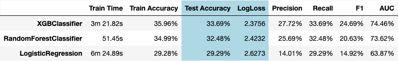
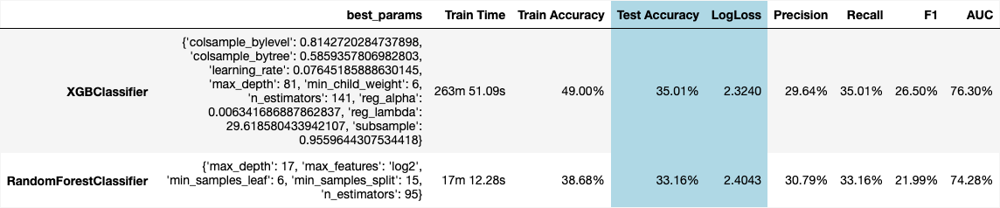

# Are we in a Doom Loop, San Francisco?
<table style="width:100%"><tr>
<td width="100%">
  
   <em>Figure 1: Crime Incident Distribution by location (2018 - Present)</em>
</td>
</tr></table>

Capstone Project 
UC Berkeley ML/AI Professional Certification coursework 
Fazeel Mufti

  
**Resources**

* [`ExploratoryDataAnalysis.ipynb`](https://github.com/fazeelgm/UCB_ML_AI_Capstone/blob/main/notebooks/ExploratoryDataAnalysis.ipynb)
  * Jupyter notebook containing the initial exploratory data analysis (EDA) of the dataset to develop a domain understanding
  * Includes data retrieval and cleanup required before we can apply DS/ML techniques
* [`ModelExploration.ipynb`](https://github.com/fazeelgm/UCB_ML_AI_Capstone/blob/main/notebooks/ModelExploration.ipynb)
  * Jupyter notebook detailing the Data Models that were explored
  * Includes tuning various classification models and analysis of the wining `XGBClassifier` model
* [`ModelVisualizations.ipynb`](https://github.com/fazeelgm/UCB_ML_AI_Capstone/blob/main/notebooks/ModelVisualizations.ipynb)
  * Visualizations developed to support the project story line
* `src` directory: Utility python code for the project
* `data` directory: You can download this file to play with the data yourself or get the latest from SFGov links below

## Executive summary

I am interested in forecasting and classification problems and use of data for finding solutions to social issues. As a San Francisco resident, I have looked skeptically at recent reporting on the **_San Francisco Doom Loop_**! There has been a regular narrative that the city's downtown area is in a downward spiral due to a combination of pandemic-related effects, declining foot traffic, rising homelessness, drug use, and businesses closing. The term gained traction as offices remained empty following COVID-19, which reduced the city's tax revenues, led to closures of key stores, and increased concerns about safety.

I came across this daily feed from the SF Police Dept. (SFPD) from January 2018 thru the present. I used this data of triaged crime incidents as a way to test the **_San Francisco Doom Loop hypothesis_**. My goals are to:

> 1. Correctly classify the crime category based on the historical data as categorized by SFPD officers
> 1. Learn how machine learning and Data Sciences can be applied to Social Engineering issues

This work is part of my Capstone Project for the UC Berkeley Artificial Inetlligence and Machine Learning Professional Certification.

### Tl;DR

#### This is a hard problem!

#### The more things change, the more they remain the same!

#### It's the stories we tell!

* Build Narratives that Support Ground Reality
* Refute False Narratives

This is a very high-level synopsis of my findings, I invite you read the rest of this Summary Report and then dive deeper into the associated notebooks - there is a lot of interesting data, especially for anyone who's walked the streets of San Francisco!

## The Data - SFPD Daily Crime Incidents Reports

As part of the [City of San Francisco's Open DataSF Project](https://datasf.org/opendata/), the San Francisco Police Deparment (SFPD) provides a daily feed of Police Crime Incidents to the public for accountability purposes. This data has been made available since 2003 and provides a snapshot of crimes reported and investigated by the SFPD. Incoming reports are triaged and categorized based on the incident details and resolution. As such, this is a great resource on the makeup of crime in the City, and gives us an opportunity to apply Data Science (DS) and Machine Learning (ML) to analyze trends over a significant period of time.

The dataset is available as two CSV files with historical data from 2003-2018 and 2018-Present:

1. [San Franciso Police Department Incident Reports: Historical 2003 to May 2018](https://data.sfgov.org/Public-Safety/Police-Department-Incident-Reports-Historical-2003/tmnf-yvry/about_data)
1. [Police Department Incident Reports: 2018 to Present](https://data.sfgov.org/Public-Safety/Police-Department-Incident-Reports-2018-to-Present/wg3w-h783/about_data)

For this project, we will use the 2018-Present data as we are focused on the Doom Loop around the Covid Pandemic period:

* DataType: Time Series data for SFPD incidents reported by:
  * Police officers
  * Citizens using SFPD website and Twitter/X
* Published daily and ranges from Jan 1, 2003 up to the current time
* Includes categorization and sub-categorization of incidents, as well as resolution codes
* Include GIS (LatLong) and neighborhood data that can be cross-indexed with other SF City datasets
* Contains data for _incoming incidents_, not their final resolution, so this is not a way to gauge crime resolution, but onlhy a barometer of the overall incidence rates

  
#### Methodology
1. Exploratory Data Analysis: we first analyze the data to understand it and prepare it for the Data Modeling phase. The work summarized here is detailed in the  Jupyter notebook
2. Model Exploration: We start with a few ML models suitable for multi-class classification problems, identify good candidates for optimization and evaluate them on our evaluation criteria
3. Interpretation of Best Model: Finally we apply learnings from the trained model to our Doom Loop scenario

### Exploratory Data Analysis

## Model Development

#### Results

<table style="width:100%"><tr>
  <td width="100%"><em>Figure TO_DO: Results Tally</em></td>
</tr></table>

<table style="width:100%"><tr>
  <td width="100%"><em>Figure TO_DO: Candidate Models for Tuning</em></td>
</tr></table>

<table style="width:100%"><tr>
  <td width="100%"><em>Figure TO_DO: Hyperparameter Tuning Results</em></td>
</tr></table>

## Evaluation & Interpretation

## Next steps
